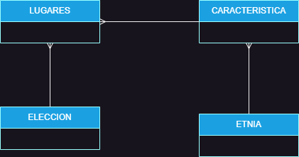
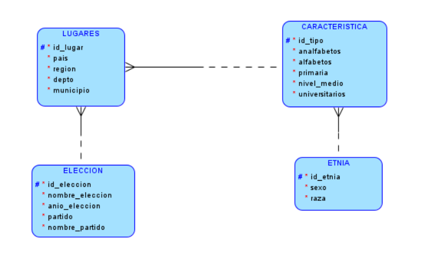
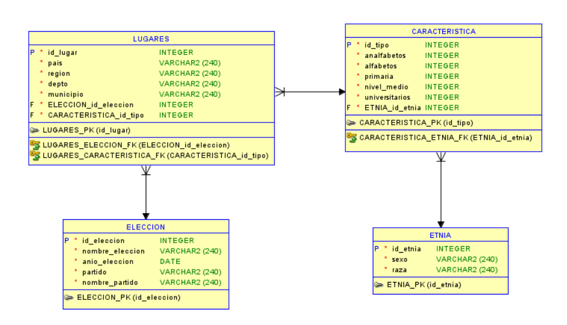

# SBD1_Proyecto_Magistral
## PROYECTO ELECCIONES
### GRUPO # 10

### - 201603171 Erick Erasmo Jiménez Palacios 2816057340101@ingenieria.usac.edu.gt
### - 201908251 José Pablo Cerón Urizar 3005814320101@ingenieria.usac.edu.gt
### - 201807169 Erick Abdul Chacón Barillas 3508630320101@ingenieria.usac.edu.gt
### - 202000896 Javier Alejandro Matías Guarcas 3681430070101@ingenieria.usac.edu.gt

## Análisis describiendo las reglas de normalización aplicadas al archivo de excel

Para este caso se implemento la segunda forma normal (2NF) y consiste en lo siguiente:

### Estar en Primera Forma Normal (1NF):

- Para estar en 1NF, una tabla debe contener solo valores atómicos (sin listas ni repeticiones), y cada fila debe ser única.

### Elimina dependencias parciales:

- Una dependencia parcial ocurre cuando un atributo no clave depende solo de parte de la clave primaria, en lugar de depender de toda la clave.

- Este problema es común en tablas con claves primarias compuestas.

- Para cumplir con la 2NF, los atributos que dependen parcialmente de la clave primaria se deben mover a una tabla separada, manteniendo solo las dependencias completas en la tabla original.

Los resultados de las tablas y entidades quedaron de la siguiente manera:

TABLA_LUGARES

- id_lugar # (INTEGER) (AUTOINCREMENT)

- id_eleccion (INTEGER) (TABLA_ELECCION)

- pais VARCHAR (240)

- region VARCHAR (240)

- depto VARCHAR (240)

- municipio VARCHAR (240)

- id_caracteristica (INTEGER) (TABLA_CARACTERISTICA)

TABLA_CARACTERISTICA

- id_caracteristica # (INTEGER) (AUTOINCREMENT)

- id_etnia (INTEGER) (TABLA_ETNIAS)

- analfabetos (INTEGER)

- alfabetos (INTEGER)

- primaria (INTEGER)

- nivel_medio (INTEGER)

- universitarios (INTEGER)

TABLA_ELECCION

- id_eleccion # (INTEGER) (AUTOINCREMENT)

- nombre_eleccion VARCHAR (240)

- ano_eleccion DATE

- partido (VARCHAR (240))

- nombre_partido (VARCHAR (240))
	
TABLA_ETNIA

- id_etnia	# (INTEGER) (AUTOINCREMENT)

- sexo VARCHAR (240)

- raza VARCHAR (240)

## Pasos que se siguieron para aplicar las reglas de normalización

1. Se eliminó la columna de "sexo" y "etnia" debido a que estaban duplicadas. Solo se dejó una de ellas
2. Se creó la tabla etnia con id autoincrementable
3. Se creó la tabla lugares que contiene la información de los lugares
4. Se creó la tabla eleccion con información de los partidos
5. De último se creó la tabla caracterítica que contiene información macro de los votantes.

## Modelo conceptual

### Aqui mostraremos detalles de lo que consiste en este diagrama conceptual

### 1. Entidad Lugar:
- Atributos: `id_lugar`, `pais`, `region`, `depto`, `municipio`, `id_eleccion`, `id_caracteristica`.

- Relaciones: 
    - Un lugar está asociado a una única elección (uno a uno con `TABLA_ELECCION`).
    - Un lugar puede tener múltiples características asociadas (uno a muchos con `TABLA_CARACTERISTICA`).

### 2. Entidad Elección:
- Atributos: `id_eleccion`, `nombre_eleccion`, `ano_eleccion`, `partido`, `nombre_partido`.
- Relaciones:
    - Una elección puede estar relacionada con múltiples lugares (uno a muchos con `TABLA_LUGARES`).

### 3. Entidad Característica:
- Atributos: `id_caracteristica`, `id_etnia`, `analfabetos`, `alfabetos`, `primaria`, `nivel_medio`, `universitarios`.

- Relaciones:
    - Una característica pertenece a un único lugar (uno a uno con `TABLA_LUGARES`).
    - Una característica puede tener múltiples etnias asociadas (uno a muchos con `TABLA_ETNIA`).

### 4. Entidad Etnia:
- Atributos: `id_etnia`, `sexo`, `raza`.

- Relaciones:
    - Una etnia puede estar asociada a múltiples características (uno a muchos con `TABLA_CARACTERISTICA`).

---
---
---
## Modelo logico

### Este diagrama a grandes rasgos maneja acerca del funcionamiento de un sistema político la cual es una herramienta muy util para comprender en como funciona el gobierno.

### Los elementos adicionales que conlleva este diagrama es el siguiente:

- Lugares: Son las unidades territoriales en las que se organiza el sistema politico. Los lugares pueden ser paises, regiones, departamentos o municipios

- Elecciones: Son los procesos mediante los cuales los ciudadanos eligen a sus representantes. Las elecciones pueden ser locales, regionales o naciones.

- Partidos Políticos: Son las organizaciones que agrupan a los ciudadanos que comparten una ideología politica común. Los partidos politicos compiten en las elecciones para obtener representacion en el gobierno

- Etnias: Son los grupos de personas que comparten una cultura e identidad comunes. Las etnias pueden estar representadas en el sistema político a través de partidos politicos, grupos de interés u organizaciones no gubernamentales.

---
---
---

## Modelo entidad-relacion

### El diagrama del sistema político muestra una seria de relaciones entre los diferentes elementos. Las principales relaciones son las siguientes:

- Entidad Lugares y Entidad Eleccion: Cada registro en la tabla `TABLA_LUGARES` tiene una relacion con un registro en la tabla `TABLA_ELECCION`, ya que `id_eleccion` en `TABLA_LUGARES` es una clave externa que hace referencia a `id_eleccion` en `TABLA_ELECCION`. Esto implica que un lugar puede estar asociado a una única elección pero una elección puede estar relacionada con múltiples lugares.

- Entidad Lugares y Entidad Caracteristica: Hay una relacion entre `TABLA_LUGARES` y `TABLA_CARACTERISTICA`. La clave externa `id_caracteristica` en `TABLA_LUGARES` se refiere a `id_caracteristica` en `TABLA_CARACTERISTICA`. Esto significa que un lugar puede tener múltiples características asociadas, pero una característica solo pertenece a un lugar.

- Entidad Caracterisitca y Tabla Etnia: Igualmente, hay una relación de uno a muchos entre `TABLA_CARACTERISTICA` y `TABLA_ETNIA`. La clave externa `id_etnia` en `TABLA_CARACTERISTICA` se refiere a `id_etnia` en `TABLA_ETNIA`. Esto indica que una característica puede tener múltiples etnias asociadas, pero una etnia pertenece a una sola característica.